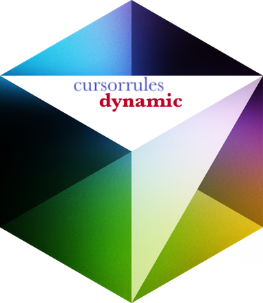

# Cursor Rules Dynamic

[](https://github.com/fleXRPL/cursor-rules-dynamic/actions/workflows/ci.yml)
[](https://opensource.org/licenses/MIT)
[](https://www.typescriptlang.org/)
[](https://code.visualstudio.com/api)
[](https://github.com/features/packages)



A VSCode extension for dynamic management and analysis of `.cursorrules` files in your Cursor AI projects.

## Features

- 🔍 **Dynamic Analysis**: Automatically analyzes your project's codebase to suggest and update `.cursorrules` configurations
- 🔄 **Real-time Monitoring**: Watches for file changes and suggests rule updates based on evolving code patterns
- 📝 **Template Management**: Browse and apply pre-configured rule templates for various project types
- 🛠️ **Format Conversion**: Convert between different `.cursorrules` formats with preview and backup capabilities
- 📊 **Project Scanning**: Scan your project to detect patterns and generate optimized rules
- 🔐 **Version Control**: Maintains backups and history of rule changes

## Installation

1. Install the extension from the VSCode marketplace or GitHub Packages:

   ```bash
   npm install @flexrpl/cursor-rules-dynamic
   ```

2. Configure your GitHub Personal Access Token for package access:

   ```bash
   export NODE_AUTH_TOKEN=your_github_pat
   ```

## Usage

### Commands

The extension provides several commands through the VSCode Command Palette (Cmd/Ctrl + Shift + P):

- `Cursor Rules: Show Status` - Display the current status of rule monitoring
- `Cursor Rules: Convert to JSON` - Convert a `.cursorrules` file to JSON format
- `Cursor Rules: Browse Templates` - Browse and apply rule templates
- `Cursor Rules: Scan Project` - Analyze project and suggest rule updates

### Features in Detail

#### Dynamic Analysis

The extension continuously analyzes your project's code patterns, including:

- Naming conventions
- Project structure
- Code formatting
- Documentation styles
- Testing patterns

#### Template Management

- Browse curated templates for different project types
- Preview templates before applying
- Automatic backup of existing rules
- Custom template support

#### Project Scanning

- Detect code patterns and conventions
- Suggest rule updates based on analysis
- Preview changes before applying
- Maintain rule version history

## Development

### Prerequisites

- Node.js ≥ 18.x
- VSCode ≥ 1.96.0
- TypeScript 5.3.3

### Setup

1. Clone the repository:

   ```bash
   git clone https://github.com/fleXRPL/cursor-rules-dynamic.git
   cd cursor-rules-dynamic
   ```

2. Install dependencies:

   ```bash
   cd vscode-extension
   npm install
   ```

3. Build the extension:

   ```bash
   npm run compile
   ```

### Testing

Run the test suite:

```bash
npm test
```

Generate coverage report:

```bash
npm run test:coverage
```

### Building

Create a VSIX package:

```bash
npm run package
```

## Contributing

1. Fork the repository
2. Create your feature branch
3. Commit your changes
4. Push to the branch
5. Create a Pull Request

Please ensure your PR:

- Passes all tests
- Includes relevant tests
- Updates documentation
- Follows the existing code style

## License

This project is licensed under the MIT License - see the [LICENSE](LICENSE) file for details.

## Support

- File an [issue](https://github.com/fleXRPL/cursor-rules-dynamic/issues)
- Join the [discussions](https://github.com/fleXRPL/cursor-rules-dynamic/discussions)
- Check the [wiki](https://github.com/fleXRPL/cursor-rules-dynamic/wiki) for detailed documentation
